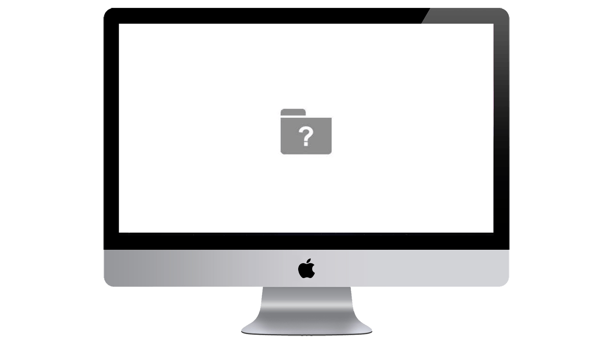

# readme
Personal Asset Manager README.md 
<!-- This template was created following The Markdown Guide - https://www.markdownguide.org/ -->

<!-- If you are editing this README.md on VS Code, please highlight and replace the following keywords enclosed in backticks (``) using:
* MacOS: CMD + Shift + L
* Windows: CRTL + Shift + L

Project Description: `In an uncertain economic enviornment, being aware of one's personal finance has become crucial to most individuals, especially considering the high rate of inflation that we are going through in 2022. Economists predict that future pensions will not be enough to support the mayority of workers. 

With that in mind, team #3 has developed a tool that helps to keep track of one's personal finances in an orderly manner in cryptocurrency shown in Mexican pesos. There is also a graphic aid in the form of a tree map that will allow the user to better understand the configuration of their assets by showing the percentage of the asset in their portfolio.`
-->

<!-- Please also update the following links -->
[logo]: ./img/logo.png
[application-image]: ./img/app-image.webp
[application-url]: https://example.com/

 

<!-- Badges / Shields -->
<!-- These were created using https://shields.io/ - feel free to replace / create yours by modifying links below: -->

    <a href="https://github.com/richardguarnieri/readme-template/graphs/contributors">
        
    <a>
     <a href="https://github.com/richardguarnieri/readme-template/network/members">
        
    <a>
     <a href="https://github.com/richardguarnieri/readme-template/stargazers">
        
    <a>
     <a href="https://github.com/richardguarnieri/readme-template/issues">
        
    <a>
     <a href="https://github.com/richardguarnieri/readme-template/blob/main/LICENSE">
        
    <a>
     <a href="https://github.com/richardguarnieri/readme-template/commits/main">
        
    <a>

 

<!-- Header -->

//

    
    <h1 align="center">The README.md Template</h1>
    

        A README.md template for your projects!
         
        <a href="https://github.com/richardguarnieri/readme-template">
            <strong>Explore Documentation</strong>
        </a>
         
         
        <a href="https://github.com/richardguarnieri/personal-asset-manager">View Demo</a>
        ·
        <a href="https://github.com/richardguarnieri/personal-asset-manager/issues">Report Bug / Request Feature</a>
    

 //

<!-- Table of Contents -->
## Table of Contents

- [readme](#readme)
  - [Table of Contents](#table-of-contents)
  - [The Project](#the-project)
    - [Technology Stack](#technology-stack)
  - [How to Use](#how-to-use)
    - [Prerequisites](#prerequisites)
  - [Contributing](#contributing)
  - [License](#license)
  - [Contact](#contact)
 

<!-- The Project -->
## The Project

[![Application Image][application-image]][application-url]

Team #3 has developed a comprehensive tool that uses HTML, CSS, and JavaScript to allow the user to keep track of their assets in a virtual manner by using APIs to keep track in real time of the value of the assets that the  user has. 
The API used to keep track of the cryptocurrency is the Coingecko API: https://api.currencyapi.com/v3/latest?apikey=YZndrhB9DKHgxOkVDfjPtj3W0R7xSet7pPMYgqmO&currencies=MXN, and the API used to keep track of the fiat currency is https://api.currencyapi.com/v3/latest?apikey=YZndrhB9DKHgxOkVDfjPtj3W0R7xSet7pPMYgqmO&currencies=MXN.

 - <a href="#home">Return to Home</a>

### Technology Stack

Use this section to list the technologies used in the project - examples:

* [HTML](https://html.spec.whatwg.org/)
* [CSS](https://www.w3.org/TR/CSS/#css)
* [JavaScript](https://www.ecma-international.org/publications-and-standards/standards/ecma-262/)
* [Tailwind]
* [D3]

 - <a href="#home">Return to Home</a>

<!-- How to Use -->
## How to Use

When using the tool, the user shall click the "Assets+" button to select a cryptocurrency. A menu will display and there will be a list of cryptocurrencies to select from. It is possible to choose a cryptocurrency manually or typing the name of the desired crytpocurrency into the box. The tool will automatically display the worth of the cryptocurrency in Mexican pesos.  

_For more examples, please refer to the [Documentation][documentation-url]._

 - <a href="#home">Return to Home</a>

### Prerequisites

Use an updated internet browser.

 - <a href="#home">Return to Home</a>

<!-- Contribuiting -->
## Contributing

Contributions are much welcomed! If you have suggestions to make this application better, please fork the repo and create a pull request. 

You can also open an issue [here][github-issues-url] and tag it with the **"enhancement"** label.

 - <a href="#home">Return to Home</a>

<!-- License -->
## License

This project is licensed under the terms of the MIT license. 

See `LICENSE` for more information.

 - <a href="#home">Return to Home</a>

<!-- Contact -->
## Contact

Richard Guarnieri: richard.gm@outlook.com · LinkedIn: [rguarnieri][linkedin-url] · Twitter: [@ric_guarnieri][twitter-url]

Application URL: [https://example.com/][application-url]

<!-- References, Links and Images -->
<!-- Badges / Shields Styles -->
[github-contributors-shield]: https://img.shields.io/github/contributors/richardguarnieri/readme-template?style=for-the-badge
[github-forks-shield]: https://img.shields.io/github/forks/richardguarnieri/readme-template?style=for-the-badge
[github-stars-shield]: https://img.shields.io/github/stars/richardguarnieri/readme-template?style=for-the-badge
[github-issues-shield]: https://img.shields.io/github/issues/richardguarnieri/readme-template?style=for-the-badge
[github-license-shield]: https://img.shields.io/github/license/richardguarnieri/readme-template?style=for-the-badge
[github-last-commit-shield]: https://img.shields.io/github/last-commit/richardguarnieri/readme-template?style=for-the-badge
[linkedin-shield]: https://img.shields.io/badge/-LinkedIn-black.svg?style=for-the-badge&logo=linkedin&colorB=555

<!-- Badges / Shields URL -->
[github-contributors-url]: https://github.com/richardguarnieri/readme-template/graphs/contributors
[github-forks-url]: https://github.com/richardguarnieri/readme-template/network/members
[github-stars-url]: https://github.com/richardguarnieri/readme-template/stargazers
[github-issues-url]: https://github.com/richardguarnieri/readme-template/issues
[github-license-url]: https://github.com/richardguarnieri/readme-template/blob/main/LICENSE
[linkedin-url]: https://linkedin.com/in/rguarnieri

<!-- Non Badge / Shield Reference Links -->
[documentation-url]: https://github.com/richardguarnieri/readme-template